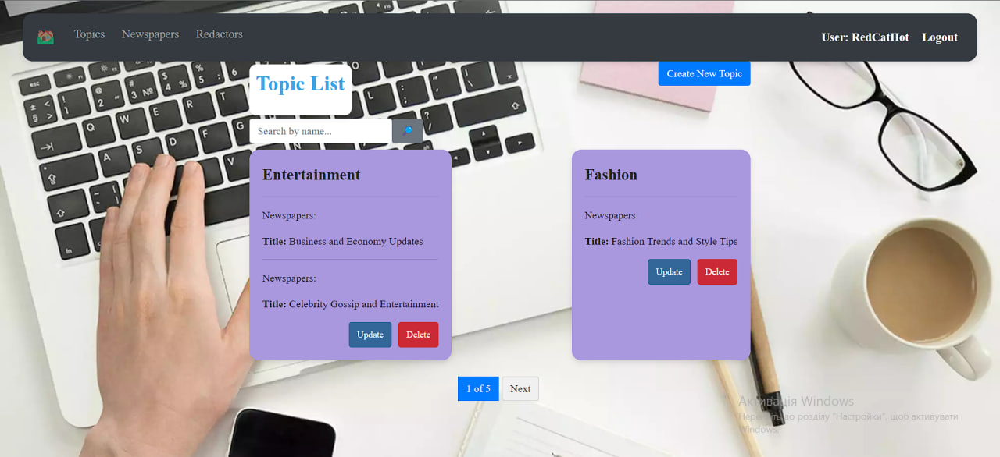

# Newspaper Agency

Django project for managing newspapers, redactors and topics

## Check it out

[Newspaper Agency project deployed to Render](https://newspaper-mate.onrender.com)

## Installation

Python3 must be already installed

shell  
git clone https://github.com/RedCatHot/newspaper_agency_projecty/tree/develop   
cd newspaper agency   
python -m venv venv  
venv\Scripts\activate (on Windows)  
source venv/bin/activate (on macOS)  
pip install -r requirements.txt  
python manage.py runserver #starts Django Server

## Default user for website

username: RedCatHot  
password: Whatislove123

## Demo

## Home page
   
  
## Topics list page
    
  
## Newspapers list page
  

## Redactors list page
  

Also we can create, update(edit) and delete. We can know details about redactors, for example.  
And we cant do anything if we are not logged in. Look 
## Login/Logout pages
  
  

